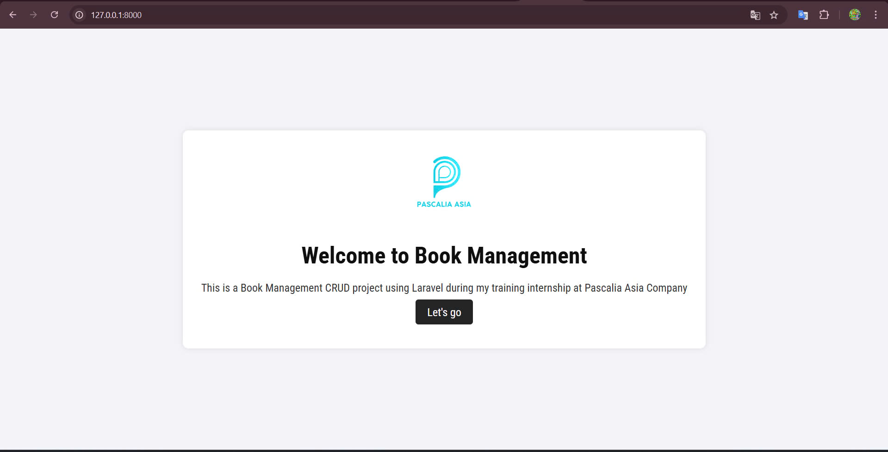

# CRUD Book Management

## Table of Contents
1. [Introduction](#introduction)
2. [Features](#features)
3. [Technologies Used](#technologies-used)
4. [Installation](#installation)
5. [Usage](#usage)
6. [Configuration](#configuration)
7. [Documentation](#documentation)
8. [Screenshots](#screenshots)
9. [Troubleshooting](#troubleshooting)
10. [Contributors](#contributors)
11. [License](#license)

## Introduction
CRUD Book Management is a web application built with Laravel that allows users to manage a collection of books. Users can create, read, update, and delete book records.

## Features
- Add new books
- Edit existing books
- Delete books
- View a list of all books

## Technologies Used
- Laravel
- PHP
- MySQL
- Tailwind CSS
- JavaScript

## Installation
1. Clone the repository:
    ```sh
    git clone https://github.com/khamko07/Book_Management.git
    ```
2. Navigate to the project directory:
    ```sh
    cd CRUD_Book_Management
    ```
3. Install dependencies:
    ```sh
    composer install
    npm install
    ```
4. Copy the `.env.example` file to `.env` and configure your environment variables:
    ```sh
    cp .env.example .env
    ```
5. Generate an application key:
    ```sh
    php artisan key:generate
    ```
6. Run the database migrations:
    ```sh
    php artisan migrate
    ```

## Usage
1. Start the development server:
    ```sh
    php artisan serve
    ```
2. Open your browser and navigate to `http://localhost:8000`.

## Configuration
- Configure your database and other environment variables in the `.env` file.

## Documentation
- Detailed documentation can be found in the [Laravel Documentation](https://laravel.com/docs).

## Screenshots



## Troubleshooting
- If you encounter any issues, please check the Laravel logs in `storage/logs/laravel.log`.

## Contributors
- Pascalia Asia Company

## License
© 2025 Khamko. All rights reserved.
